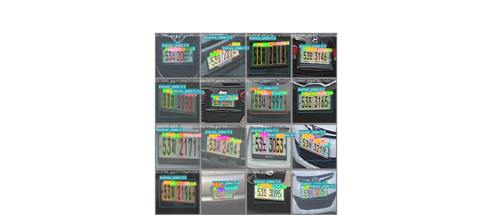
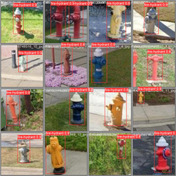
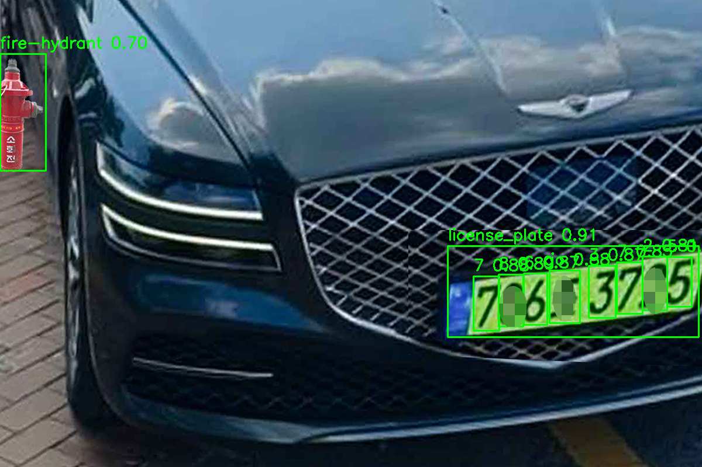

# 요일별 주차 단속과 소화전 앞 불법주차 디텍팅 및 음성안내

### Seongeun Lee, Juho Kim, Hyein Bae

간단한 설명: YOLOv5를 이용하여 번호판과 번호판 글자를 인식합니다. 번호판마다 차량종류(대형,소형,응급차 등등)를 인식합니다. YOLOv5로만 글자를 다 인식하게 하여 불필요한 추가학습은 제거 했습니다. 소화전 또한 같이 탐색 하였습니다. 인식된 번호판을 TEXT로 출력하였습니다.
[YOLOv5](https://github.com/ultralytics/yolov5)
음성안내는 카카오에서 만든 VITs TTS모델을 이용하여 학습하였습니다.[참고1.VITs](https://github.com/jaywalnut310/vits)과 [참고2.VITs](https://github.com/ouor/vits?tab=readme-ov-file)를 참고해주시기 바랍니다.

목소리는 Korean Single Speaker Speech Dataset(KSS)으로 학습하였습니다.
[KSS_Dataset](https://www.kaggle.com/datasets/bryanpark/korean-single-speaker-speech-dataset)데이터셋은 이곳에서 다운로드 하였습니다.

```sh
conda create -n detect_car python==3.9
conda activate detect_car
pip3 install torch==1.13.1 torchvision==0.14.1 torchaudio==0.13.1 --index-url https://download.pytorch.org/whl/cu117
cd vits
pip install -r requirements.txt
```

4500개의 번호판 데이터와 1500개의 소화전으로 YOLOv5를 학습시켰습니다.
훈련은 100번 200번 시켰습니다.
훈련파일은 pt폴더에 제공하겠습니다.


<table style="width:100%">
  <tr>
    <th>번호판 훈련</th>
    <th>소화전 훈련</th>
  </tr>
  <tr>
    <td></td>
    <td></td>
  </tr>
</table>
pt 파일경로를 반드시 준수해주시기 바랍니다.
 
pt파일은 [Drive](https://drive.google.com/drive/folders/1or_V69FZXuKrP0Shms51-A8xhTkm7ppT?usp=drive_link)에서 확인부탁드립니다.
```
./
├──vits
|    └── checkpoint
|             └──lasttry    
|                  └──G_51000.pt, D_51000.pt
└── fire_epoch200.pt,car_epoch100.pt
```


- main.py 에서 적용시킬 이미지를 설정해줍니다.
```sh
python main.py
```



결과 이미지입니다. 
음성파일과 텍스트번호판 인식 파일은 others_result 폴더에서 확인하시면 됩니다.


